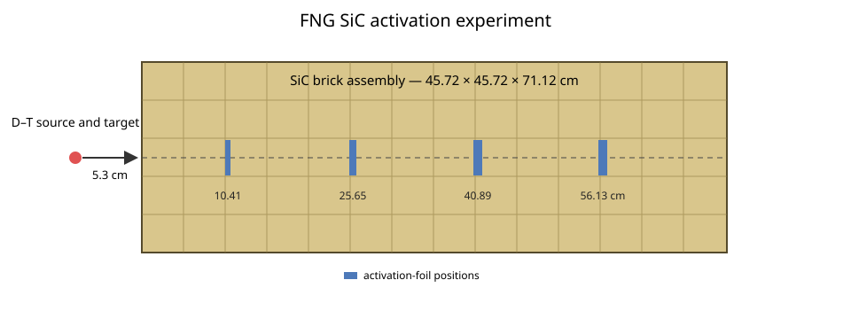
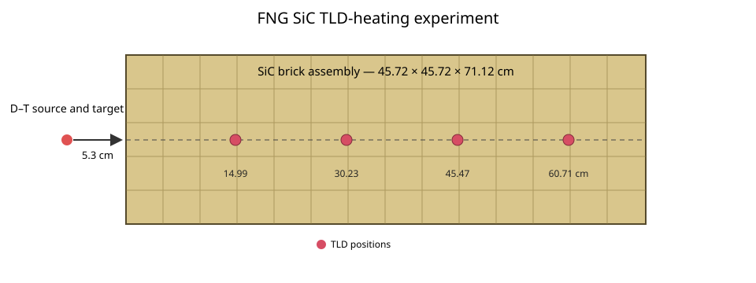

# FNG SiC integral experiments

This case represents the FNG silicon-carbide integral experiments in SINBAD V2 benchmark **FUS-ATN-BLK-STR-PNT-017-DR** (legacy entry NEA-1553/56). They were performed at the Frascati Neutron Generator in 2001 to test activation dosimetry and nuclear heating through a fusion-relevant SiC shield [1, 2]. The activation foils and thermoluminescent dosimeters were modeled in separate supplied MCNP inputs and occupy different measurement positions, so they are retained as separate MC/DC cases.

## Activation experiment

The [`activation`](activation) case follows the activation-foil configuration. Aluminum response volumes are located on the central axis at depths of 10.41, 25.65, 40.89, and 56.13 cm. The benchmark quantities of interest are the per-atom reaction rates for Nb-93(n,2n), Al-27(n,α), Ni-58(n,p), and Au-197(n,γ). The prescribed IRDF response functions—not the aluminum cell material—define those reactions. MC/DC currently records the neutron spectra required for response folding but cannot yet score arbitrary MT-specific IRDF responses, so its plot is an intermediate response-folding input rather than a final C/E comparison.

## TLD-heating experiment

The [`tld`](tld) case follows the nuclear-heating configuration. Four GR-200 LiF:Mg,Cu,P dosimeters in polyethylene holders are represented at each of the four depths: 14.99, 30.23, 45.47, and 60.71 cm. The benchmark quantity of interest is total absorbed dose, formed from the neutron response of the TLD material and the photon energy-deposition contribution. MC/DC currently records the neutron spectra in the LiF volumes, but complete closure also requires neutron-response weighting, neutron-induced photon production, photon transport, and photon energy deposition.

Both configurations use the same 45.72 cm × 45.72 cm × 71.12 cm block assembled from 116 SiC bricks at an average density of 3.158 g/cm³. The homogeneous block retains the supplied calculation's nuclide representation and impurity mass fractions rather than reconstructing ideal stoichiometric SiC. The experimental activation uncertainties combine HPGe calibration, activity measurement, and source-yield contributions; the TLD uncertainties combine calibration, detector repeatability, and source yield. The package supplies no covariance matrix or complete set of model-form uncertainties, and the Au response is particularly sensitive to the uncertain boron impurity concentration [1]. All materials are assigned 293.6 K.

The D-T source is 5.3 cm in front of the block. The supplied detailed calculations use a 260 keV deuteron energy, a tritium-to-titanium ratio of 1.4, and a 0.7 cm-radius beam spot, whereas the descriptive source tables were generated with an older source routine and may differ slightly [1, 3]. MC/DC represents those tabulated angular yields and conditional energy moments with 19 weighted direction-cosine intervals and an equal-area square source footprint spanning the modeled Ti-T layer. The principal copper, water, and steel target layers are included; remote coolant tubing and support hardware from the supplied calculations are not.

## Ways to improve the MC/DC models

- **Reaction-response tallies:** user-supplied tabulated responses or MT-specific tallies would produce the benchmark activation rates directly.
- **Photon production and transport:** coupled photons and photon energy deposition are required for the gamma-dose contribution to the TLD response.
- **Native correlated angle-energy and cylindrical source distributions:** these would replace the weighted angular mixture and equal-area square approximation used for the finite D-T production spot.
- **Complete target hardware:** the remaining coolant tubes, flanges, supports, and room structures would reduce low-energy model-form uncertainty.

## References

1. P. Batistoni et al., “Neutronics Shield Experiment for ITER in a SiC Block,” *Fusion Engineering and Design* **69**, 649–654 (2003).
2. L. Petrizzi, K. Seidel, and S. Unholzer, “Sensitivity and Uncertainty Analyses of 14 MeV Neutron Benchmark Experiment on Silicon Carbide,” 22nd Symposium on Fusion Technology, Helsinki (2002).
3. A. Milocco and A. Trkov, *MCNPX/MCNP5 Routine for Simulating D-T Neutron Source in Ti-T Targets*, IJS-DP-9988 (2008).
