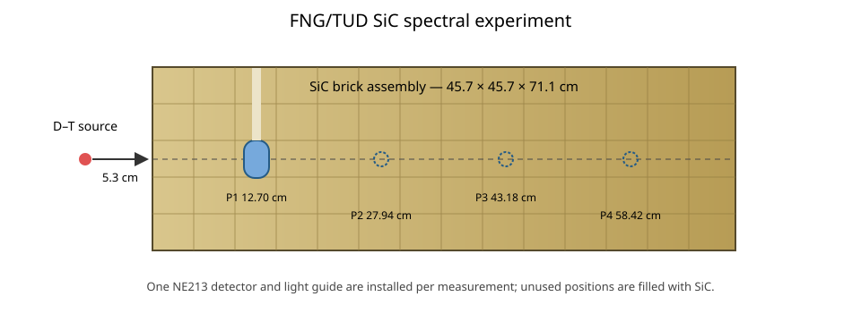

# FNG/TUD SiC neutron and photon spectra

This case represents the FNG/TUD silicon-carbide spectral experiment in SINBAD V2 benchmark **FUS-ATN-BLK-STR-PNT-009-GNS** (legacy entry NEA-1553/70). The experiment was performed at the Frascati Neutron Generator to test neutron and photon transport through a thick SiC assembly [1, 2].

The assembly is a 45.7 cm × 45.7 cm × 71.1 cm block constructed from 116 SiC bricks. Spectra were measured on the source axis at depths of 12.70, 27.94, 43.18, and 58.42 cm from the front face. These four detector configurations are separate calculation cases: `p1`, `p2`, `p3`, and `p4`, respectively. In each case, a cylindrical NE213 scintillator 3.8 cm in diameter and height is inserted at the stated position and the other positions are refilled with SiC. Each self-contained input includes the active scintillator, its polyethylene light guide, and the surrounding insertion clearance. The contiguous brick assembly is represented as a homogeneous block because the supplied calculation assigns the same composition to every brick. Its nuclide number densities follow the supplied MCNP material card—including its C-12 and Si-28 representations and measured B, Al, and Fe impurities—rather than being reconstructed from present-day natural abundances. All materials are assigned 293.6 K.

The experiment was driven by a D-T source 5.3 cm in front of the block, produced by 230 keV deuterons incident on a Ti-T target. The neutron intensity and energy spectrum both vary with emission angle [1, 3]. MC/DC samples the piecewise-linear angular yield on the 19 benchmark polar-cosine nodes. At each node, a 72-point conditional energy PDF is reconstructed from the derived energy support, mean, and width; MC/DC uses unit-base interpolation between neighboring conditional PDFs. The package notes that the descriptive source tables were generated with an older source routine and may differ slightly from the newer routine used by the supplied MCNP calculation. The supplied calculation treats the source spot as a point, which is retained here.

The benchmark quantities of interest are the unfolded neutron and neutron-induced photon flux spectra averaged over the active NE213 volume and normalized per source neutron. The neutron comparison uses the published bin boundaries from 0.999 to 15.22 MeV and the detector-cell track-length tally. The experimental one-standard-deviation uncertainties include spectrum measurement, background subtraction, and source monitoring; the package reports interval-dependent relative uncertainties rather than a value for every bin [1]. No covariance matrix or prescribed model-form uncertainties are available, so the plotted C/E values support a quantitative binwise comparison but not a covariance-aware goodness-of-fit test. Photon closure remains pending photon production and transport in MC/DC.

Each neutron calculation uses an energy-dependent weight window below 0.999 MeV. A unit-weight neutron entering that region survives Russian roulette with probability \(10^{-7}\) and is reweighted by the reciprocal probability upon survival. This suppresses transport outside the measured range without introducing a hard energy cutoff.

## Ways to improve the MC/DC model

- **D-T source fidelity:** replace the moment-matched conditional energy PDFs with data generated directly by the supplied D-T source routine when redistribution of the derived source data is permitted.
- **Cylindrical or cell-bounded spatial source:** this package's calculation uses a point source, but the physical neutron-production region has finite extent. A cylindrical or cell-bounded sampler would permit a direct experimental source-volume model.
- **Photon production and transport:** coupled neutron-photon physics and photon tallies are required to compare the simultaneously measured photon spectra.

## References

1. L. Petrizzi et al., “Neutron and Photon Flux Spectra in a SiC Benchmark Experiment,” *Fusion Engineering and Design* **51–52**, 653–660 (2000).
2. L. Petrizzi, K. Seidel, and S. Unholzer, “Sensitivity and Uncertainty Analyses of 14 MeV Neutron Benchmark Experiment on Silicon Carbide,” 22nd Symposium on Fusion Technology, Helsinki (2002).
3. A. Milocco and A. Trkov, *MCNPX/MCNP5 Routine for Simulating D-T Neutron Source in Ti-T Targets*, IJS-DP-9988 (2008).
