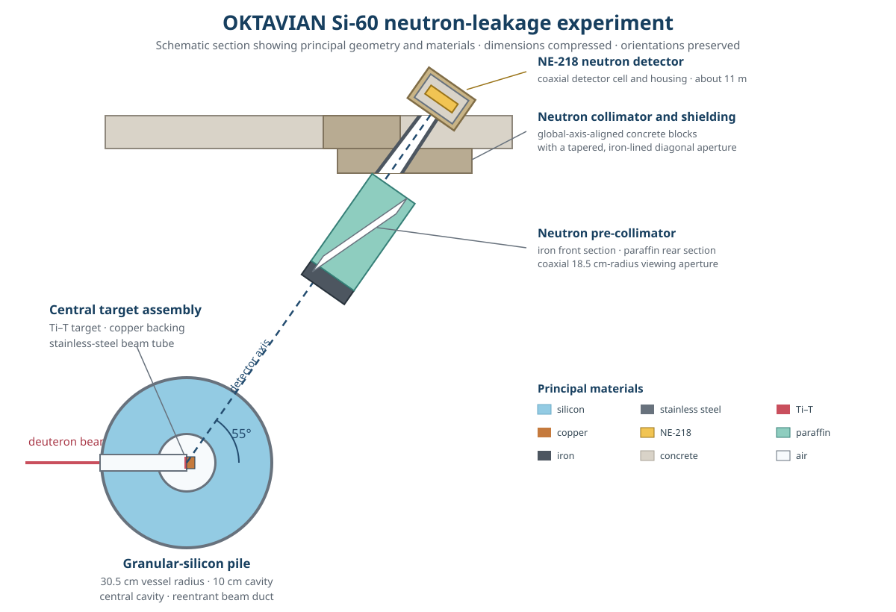
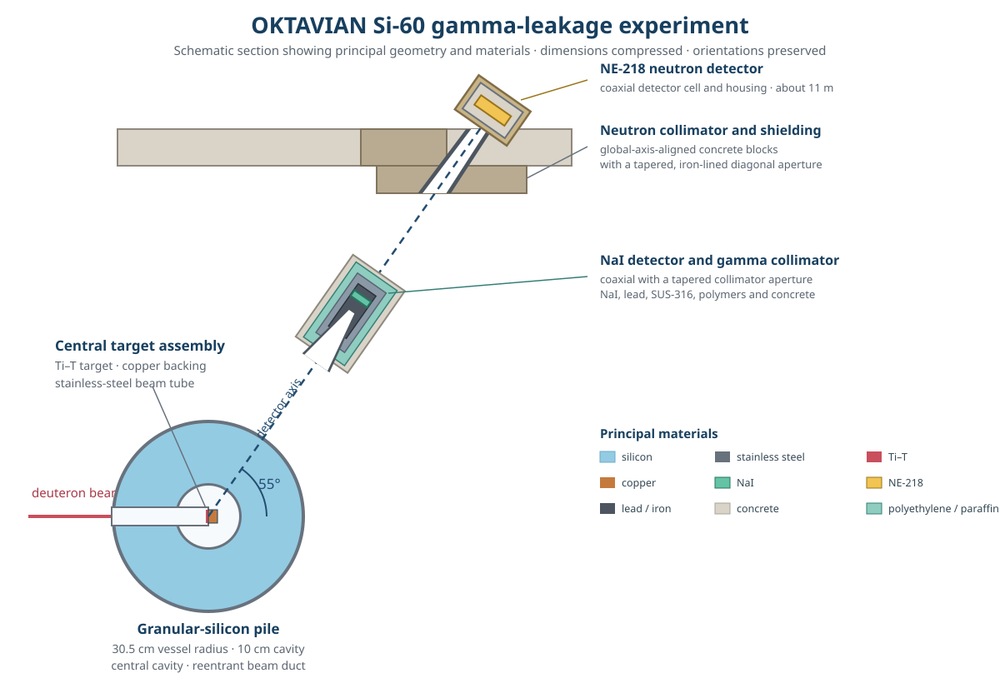

# OKTAVIAN Si-60 leakage spectra

This case represents the 60 cm silicon-pile experiments in SINBAD V2 benchmark **FUS-ATN-BLK-STR-PNT-003-FGS** (legacy entry NEA-1553/52), performed at the OKTAVIAN facility in March 1987. The package contains separate detailed models for the neutron- and gamma-leakage measurements. They share the central target, silicon pile, and principal shielding, but represent different detector-line configurations [1, 2].

The [`neutron_leakage`](neutron_leakage) case follows the detailed neutron-analysis configuration. A cylindrical NE-218 scintillator about 11 m from the target views the pile along a line 55 degrees from the deuteron-beam axis. An iron/paraffin pre-collimator between the pile and detector reduces background neutrons, followed by the main collimator, shielding, and detector housing. The quantity of interest is the neutron leakage spectrum inferred from the measured time-of-flight spectrum, corrected for detector efficiency and normalized by the monitored source strength [3, 4]. The MC/DC comparison uses an energy-filtered track-length tally in the NE-218 volume.

Validation is restricted to complete published bins from **3.0288 to 13.574 MeV**, the boundaries nearest the approximately 3-13.5 MeV defensible region identified by the benchmark assessment. Below about 3 MeV, background subtraction, room return, and low-energy detector-response effects are insufficiently specified. Above about 13.5 MeV, the result is dominated by the D-T source peak and is strongly dependent on the source energy-angle law, timing and energy resolution, detector response, and incompletely documented data reduction [1, 2].

The neutron calculation uses an energy-dependent weight window below 3.0288 MeV. A unit-weight neutron entering that region survives Russian roulette with probability \(10^{-7}\) and is reweighted by the reciprocal probability upon survival. This suppresses transport outside the comparison range without introducing a hard energy cutoff.

The [`gamma_leakage`](gamma_leakage) case follows the detailed gamma-analysis configuration. It replaces the neutron pre-collimator with the NaI detector and its lead, stainless-steel, polymer, and concrete collimator assembly at about 5.8 m, while retaining the more distant neutron-detector structures as surrounding experimental hardware. The measured quantity is the neutron-induced photon leakage spectrum obtained by unfolding the NaI pulse-height spectrum with the detector response matrix; TOF information was used to discriminate prompt gamma rays from neutron background [5, 6].

The common assembly is a spherical stainless-steel vessel filled with granular silicon around a central cavity and penetrated by a reentrant beam duct. Nuclide number densities follow the supplied MCNP models rather than being reconstructed from elemental compositions or present-day natural abundances; only their natural-carbon and natural-argon entries are expanded into explicit isotopes. Every material is assigned 293.6 K to select room-temperature nuclear data, an explicit computational assumption because the benchmark provides neither a measured sample temperature nor an MCNP `TMP` specification.

Both experiments were driven by pulsed D-T neutrons produced by deuterons incident on a Ti-T target at the center of the pile. For the neutron-leakage case, MC/DC reproduces the detailed MCNP model's tabulated piecewise-linear angular probability density and linearly interpolates the associated neutron energy over the same direction-cosine interval. Its 0.3 cm-radius source disk is represented by an equal-area square footprint distributed uniformly through the modeled 0.0011 cm Ti-T target thickness because MC/DC does not yet provide an exact finite disk-source sampler.

The detailed gamma-analysis MCNP model instead uses the supplied D-T source routine [7]. That routine transports 243 keV deuterons through the Ti-T target, including energy loss, straggling, and ion scattering, and samples the reaction kinematics and circular beam spot. MC/DC intentionally uses the neutron case's deterministic energy-angle law for both experiments so that the source is represented entirely by supported native capabilities. This is a consistent, documented approximation for the gamma case rather than an equivalent representation of its detailed MCNP source.

The neutron uncertainties are published as binwise one-standard-deviation counting uncertainties but omit the reported 0.4-1% source-normalization contribution. The gamma uncertainties combine source normalization, response-matrix, and counting contributions, without a complete distributional prescription. Neither experiment provides an experimental covariance matrix or prescribed uncertainties for the source law, detector response, timing, geometry, composition, background subtraction, or other model-form effects [1, 2]. These limitations preclude covariance-aware goodness-of-fit statistics and a formal validation pass/fail criterion.

## Ways to improve the MC/DC models

- **Cylindrical or cell-bounded spatial source:** a cylindrical sampler, or a source constrained to a cell or region, could represent the finite source volume directly instead of using an equal-area rectangular block.
- **Gamma-experiment D-T source:** reproducing the detailed MCNP source would require a tabulated joint distribution generated from the supplied D-T source routine, or an equivalent native source model.
- **Photon production and transport:** coupled neutron-photon collision physics, photon transport, and photon tallies are required to calculate the gamma-leakage benchmark observable.

## References

1. A. Milocco, *Quality Assessment of the OKTAVIAN Benchmark Experiments*, IJS-DP-10214 (2009).
2. A. Milocco, A. Trkov, and I. Kodeli, “The OKTAVIAN TOF Experiments in SINBAD: Evaluation of the Experimental Uncertainties,” *Annals of Nuclear Energy* **37**, 443-449 (2010), [doi:10.1016/j.anucene.2009.12.016](https://doi.org/10.1016/j.anucene.2009.12.016).
3. C. Ichihara et al., Proceedings of the International Conference on Nuclear Data for Science and Technology, Mito, Japan, pp. 319-322 (1988).
4. C. Ichihara et al., Proceedings of the Second Specialists' Meeting on Nuclear Data for Fusion Reactors, JAERI-M 91-062 (1991).
5. J. Yamamoto et al., “Gamma-Ray Emission Spectra from Spheres with 14 MeV Neutron Source,” JAERI-M 89-026, p. 232 (1989).
6. J. Yamamoto et al., “Integral Experiment on Gamma-Ray Production at OKTAVIAN,” JAERI-M 91-062, p. 118 (1991).
7. A. Milocco and A. Trkov, *MCNPX/MCNP5 Routine for Simulating D-T Neutron Source in Ti-T Targets*, IJS-DP-9988 (2008).
