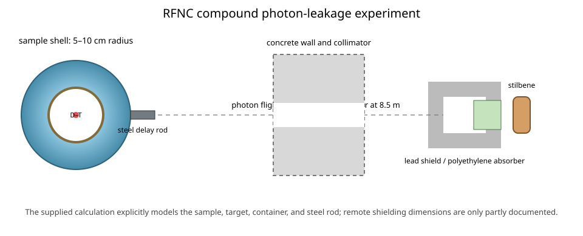

# RFNC photon spectra from H₂O, SiO₂, and NaCl

This case represents SINBAD V2 benchmark **FIS-ATN-BLK-XXX-PNT-002-GS** (legacy entry NEA-1517/80), performed at RFNC-VNIITF to test neutron-induced photon-production data for common compounds [1, 2]. Measurements were made for an H₂O sphere, SiO₂ and NaCl spheres, and the corresponding back-hemisphere configurations.

Each sample occupies the shell between 5 and 10 cm radius around a central D-T target. The sample masses are 3.60 kg H₂O, 5.34 kg SiO₂, and 5.13 kg NaCl, giving model densities of 0.982, 1.457, and 1.400 g/cm³ from the stated shell volume. The supplied MCNP calculation includes the thin copper sample container, the layered copper-water-steel target unit, and a 3 cm-diameter, 40 cm-long steel delay rod on the detector axis. The MC/DC input reproduces those neutron-relevant components and permits all five sample configurations through a required command-line selection. The back hemisphere is taken as the half of the sample away from the detector, consistent with the experimental-view convention; the package does not provide a separate hemispherical calculation input that independently resolves this orientation. Materials are assigned 293.6 K.

The physical source was produced by 200 keV deuterons incident on a tritium-loaded zirconium foil. The supplied computational benchmark replaces it with an isotropic, monoenergetic 14 MeV point source at the sample center, and the MC/DC model follows that prescribed source. Photon spectra were measured 8.5 m away with a 6 cm-diameter, 6 cm-long stilbene detector after pulse-shape neutron rejection and generalized-differentiation unfolding. The experimental arrangement also used a concrete wall and collimator, lead detector shielding, and a polyethylene neutron absorber [1]. Their locations and apertures are not specified sufficiently for a unique detector-explicit reconstruction, and the supplied MCNP model instead uses a point-flux estimator at 8.5 m.

The benchmark quantity of interest is the photon fluence spectrum from 0.368 to 8.159 MeV per 100,000 source neutrons. The package reports a 12% combined uncertainty for absolute results and approximately 5% accuracy for relative spectrum shapes, but supplies no binwise uncertainties, distributional interpretation, covariance matrix, or prescribed model-form uncertainties [1]. `plot.py` therefore shows the measured spectra with the reported 12% combined band without treating it as a one-standard-deviation interval. MC/DC currently lacks neutron-induced photon production and photon transport, so `input.py` defines the experiment-specific geometry and prescribed source and then stops explicitly instead of producing a non-benchmark neutron diagnostic.

## Ways to improve the MC/DC model

- **Photon production and transport:** coupled neutron-photon collision physics, photon transport, and photon tallies are required to calculate the benchmark observable.
- **Photon detector or point-flux estimator:** a photon-capable detector-cell tally or next-event estimator is needed to reproduce the supplied calculation's far-field spectrum efficiently.
- **Complete experimental collimation:** a detector-explicit model requires authoritative positions and apertures for the concrete wall, collimator, polyethylene insert, lead shield, and detector housing; these are not completely specified in the package.
- **Resolved hemispherical container model:** a dedicated calculation input or drawing of the flat closure and orientation would remove the remaining interpretation of the back-hemisphere configurations.

## References

1. A. I. Saukov, V. D. Lyutov, and E. N. Lipilina, “Measurement of Photon Leakage Spectra from Spherical and Hemispherical Samples of H₂O, SiO₂ and NaCl Compounds with a Central 14-MeV Neutron Source,” RFNC-VNIITF SINBAD evaluation (2007).
2. A. I. Saukov et al., “Photon Leakage from Spherical and Hemispherical Samples with a Central 14 MeV Neutron Source,” *Nuclear Science and Engineering* **142**, 158–169 (2002).
